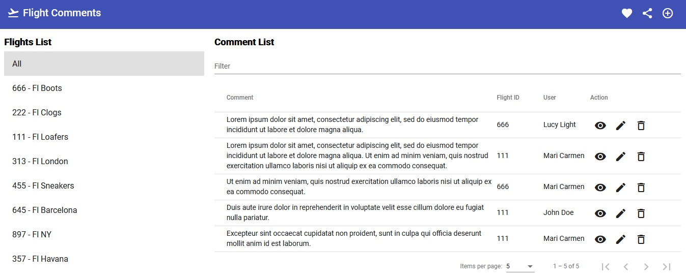

# Angular Web App Skeleton
Template to create web application based on [Angular](https://angular.io/), [Angular Material](https://material.angular.io/)
 and [KsMf](https://github.com/ameksike/ksmf/wiki) in an easy way. This project implements an example where three main entities are managed: Users, Tags and Comments.

## Run production mode
- npm run client:build
- npm start 

## Run develop mode 
- npm run client:watch
- npm run dev

## Integration 
This project depends on an external REST API service which provides all the data, therefore it works as an example of system integration. To connect this application with the external service follow the steps below:
- git clone https://github.com/ameksike/ksmf-skeleton-rest.git
- cd ksmf-skeleton-rest
- npm install
- edit ./cfg/config.json and define database access options
- npx sequelize-cli db:migrate
- npx sequelize-cli db:seed:all
- npm start
- back to this project 'ksmf-skeleton-web-angular'
- edit ```server\src\app\service\MyAPI.js``` constructor or create ```.env``` with **MyAPI_URL** and set **http://localhost:3005** or the specific configuration for the external REST API in case the default options have been changed.

For more information see the following link: [ksmf-skeleton-rest](https://github.com/ameksike/ksmf-skeleton-rest).



## Project skeleton 
```
- client 
|	+ build
|	+ public
|	+ src
|	- package.json
|	- README.md
- server	
|	+ bin/
|	|    - server.js
|	+ cfg/
|	|    - config.json
|	|    - core.json
|	+ src/
|	|    + app/
|	|    |    - index.js
|	|    + commnet/
| 	|    |    + controller/
|	|    |    |    - DefaultController.js
|	|    + user/
| 	|    |    + controller/
|	|    |    |    - DefaultController.js
- package.json
- .env
- .gitignore
- README.md
```

## Client Development Steps
- npm install -g @angular/cli
- ng new client
- cd client/
- ng serve --open 
- ng generate component components/toolbar
- ng generate service services/toolbar
- ng generate module components/flight
- ng generate component components/flight/components/list
- ng generate service components/flight/services/flight
- ng generate module components/comment
- ng generate component components/comment/components/list
- ng generate component components/comment/components/edit
- ng generate component components/comment/components/show
- ng generate component components/comment/components/layout
- ng generate component components/comment/components/tags
- ng generate service components/comment/services/comment
- ng generate service components/comment/services/tag
- ng generate service components/comment/services/user